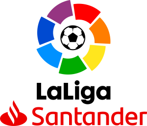

# La Liga 2020-21
*Final Project for SI507 Intermediate Programming @ Umich*  
  

## Overview 
La Liga is the men's top professional football division of the Spanish football league system.  
In this project, I plan to create a web app displaying players information from 2021/2022 LaLiga Santander football matches in Spain using Flask framework. The players data will be crawled and scraped from several pages on LaLiga’s official website. The data will be processed as a tree structure and cached in a json file. Visualizations will be created according to the statistics through seaborn, plotly or other libraries in python and will be embedded in the web app. The interactive part of this project will be based on HTML links and forms on the web app for users to click on and choose different visualizations and tables.