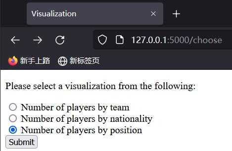

# La Liga 2020-21
*Final Project for SI507 Intermediate Programming @ Umich*

## Demo Video  
https://youtu.be/XGyZeSqkvNo

## Overview 


[La Liga](https://www.laliga.com/en-US) is the men's top professional football division of the Spanish football league system.

In this project, I collected La Liga 2020-21 season data from multiple sources, and processed them into a tree structure. A flask app is created to provide interactive data presentations.

## Code Usage
To run the app locally, download this repo to your local environment. 

### secrets.py
An API key is needed to access [API-FOOTBALL](https://www.api-football.com).
Store your API key in a new file called secrets.py:
```python
x_apisports_key = '<your api-key>'
```
**For SI507 teaching team, kindly use the secrets.py which I submitted on Canvas.**
### Packages
Required packages for the project are listed in [requirements.txt](requirements.txt):
```text
requests>=2.26.0
bs4>=0.0.1
pandas>=1.3.4
Flask>=2.0.2
beautifulsoup4>=4.10.0
plotly>=5.4.0
```
You can install the packages in the command line using:
```commandline
pip install -r requirements.txt
```

### Run Application
After getting secrets.py in the code folder and having all required packages installed, in the terminal, run:
```commandline
python laliga.py
```
You will see something like:
```commandline
 * Serving Flask app 'laliga' (lazy loading)
 * Environment: production
   WARNING: This is a development server. Do not use it in a production deployment.
   Use a production WSGI server instead.
 * Debug mode: off
 * Running on http://127.0.0.1:5000/ (Press CTRL+C to quit)
```
In your browser, visit http://127.0.0.1:5000/ to start playing with the app!

## Data Sources
**For more details (data summary, access techniques, challenge scores etc.), please see the Project Document I submitted on Canvas.**
1. API-FOOTBALL: https://www.api-football.com/  
The API is a RESTFUL API for football data. It is used to get information of the league, teams and players. 
Methods to access and cache the data are included in [api_cache.py](api_cache.py).  
Cached files are stored under [data](data) folder:  
[teams_cache.json](data/teams_cache.json) contains information of the league and all the 20 teams.  
Players data for each team are stored in **players_cache_<team_id>.json** with corresponding team ids.  


2. 2020–21 La Liga Wikipedia page: https://en.wikipedia.org/wiki/2020%E2%80%9321_La_Liga  
This is the Wikipedia page for La Liga 2020-21 season. 
It is used to get information of top goal scorers and top assist in that match season.  
The data is scraped with beautifulsoup and cached using pandas. Methods are included in [scrape_cache.py](scrape_cache.py).  
Cached files are stored under [data](data) folder:  
[goalscorers.csv](data/goalscorers.csv) stores the Top goalscorers table under [Season statistics](https://en.wikipedia.org/wiki/2020%E2%80%9321_La_Liga#Season_statistics) section.  
[assists.csv](data/assists.csv) stores the Top assists table under [Season statistics](https://en.wikipedia.org/wiki/2020%E2%80%9321_La_Liga#Season_statistics) section.

## Data Structure
The data is processed into a tree structure, 
with La Liga football league as the root node, 
team nodes as the second level, and player nodes as leaves:  
```python
class LeagueNode:
    def __init__(self, id=140, name="La Liga", country="Spain",
                 logo=None, flag=None, season=2020, teams=None):
        # primary information of league
        self.id = id
        self.name = name

        # detailed league information
        self.details = {'country': country, 'logo': logo, 'flag': flag, 'season': season}

        # list of children nodes
        if teams is None:
            teams = []
        self.teams = teams

    def set_league(self, league):
        self.id = league['id']
        self.name = league['name']
        self.details['country'] = league['country']
        self.details['logo'] = league['logo']
        self.details['flag'] = league['flag']
        self.details['season'] = league['season']

    def set_child(self, team_node):
        self.teams.append(team_node)
```
```python
class TeamNode:
    def __init__(self, rank=None, id=None, name=None, logo=None,
                 played=38, win=None, draw=None, lose=None,
                 goals_for=None, goals_against=None, goalsDiff=None,
                 points=None, description=None,
                 players=None):
        # primary information of team
        self.id = id
        self.name = name

        # detailed team information
        self.details = {'rank': rank, 'logo': logo, 'played': played, 'win': win, 'draw': draw, 'lose': lose,
                        'goals_for': goals_for, 'goals_against': goals_against, 'goalsDiff': goalsDiff,
                        'points': points, 'description': description}

        # list of children nodes
        if players is None:
            players = []
        self.players = players

    def set_team(self, team):
        self.id = team['team']['id']
        self.name = team['team']['name']
        self.details['rank'] = team['rank']
        self.details['logo'] = team['team']['logo']
        self.details['played'] = team['all']['played']
        self.details['win'] = team['all']['win']
        self.details['draw'] = team['all']['draw']
        self.details['lose'] = team['all']['lose']
        self.details['goals_for'] = team['all']['goals']['for']
        self.details['goals_against'] = team['all']['goals']['against']
        self.details['goalsDiff'] = team['goalsDiff']
        self.details['points'] = team['points']
        if team['description'] is None:
            self.details['description'] = ""
        else:
            self.details['description'] = team['description']

    def set_child(self, player_node):
        self.players.append(player_node)
```
```python
class PlayerNode:
    def __init__(self, id=None, name=None, age=None, nationality=None,
                 height=None, weight=None, photo=None,
                 matches_played=0, lineups=0, minutes=0, position=None,
                 rating=None):
        # primary information of player
        self.id = id
        self.name = name

        # detailed player information
        self.details = {'age': age, 'nationality': nationality, 'height': height, 'weight': weight, 'photo': photo,
                        'matches_played': matches_played, 'lineups': lineups, 'minutes': minutes, 'position': position,
                        'rating': rating}

    def set_player(self, player):
        self.id = player['player']['id']
        self.name = player['player']['name']
        self.details['age'] = player['player']['age']
        self.details['nationality'] = player['player']['nationality']
        if player['player']['height'] is None:
            self.details['height'] = ""
        else:
            self.details['height'] = player['player']['height']
        if player['player']['weight'] is None:
            self.details['weight'] = ""
        else:
            self.details['weight'] = player['player']['weight']
        self.details['photo'] = player['player']['photo']
        self.details['matches_played'] = player['statistics'][0]['games']['appearences']
        self.details['lineups'] = player['statistics'][0]['games']['lineups']
        self.details['minutes'] = player['statistics'][0]['games']['minutes']
        self.details['position'] = player['statistics'][0]['games']['position']
        if player['statistics'][0]['games']['rating'] is None:
            self.details['rating'] = ""
        else:
            self.details['rating'] = player['statistics'][0]['games']['rating']
```
After creating the three kinds of nodes, a tree is constructed using LeagueNode as the root:
```python
def Construct_Tree(root):
    tree = {
        'NodeType': 'LeagueNode',
        'id': root.id,
        'name': root.name,
        'details': root.details,
        'children': [
            {
                'NodeType': 'TeamNode',
                'id': team.id,
                'name': team.name,
                'details': team.details,
                'children': [
                    {
                        'NodeType': 'PlayerNode',
                        'id': player.id,
                        'name': player.name,
                        'details': player.details
                    }
                    for player in team.players
                ]
            }
            for team in root.teams
        ]
    }
    with open('data/tree.json', "w") as treeFile:
        json.dump(tree, treeFile)
    return tree
```
For full codes, please see [utils.py](utils.py).  
The resulting tree is cached and stored in [tree.json](data/tree.json).  
The code that reads and caches the tree is included in [load_data.py](load_data.py)

## Interaction and Presentation Options
User interactions are based on the Flask web application.  
There are four general types of presentation options on the homepage:
  
1. Tree structure view  
If you go to Tree Structure, you will see the data structure diagram for this project.  
You can click on the triangle buttons to show/hide teams and players:
  
  
By clicking on the "see detail" buttons, you can see detailed information of the league/the corresponding team.  
  
  
By clicking on "See all players in <team_name>" button on each team detail page, a list of all the players in the team will be shown with their statistics and information.  
  
You also have the option to look at individual players by clicking on their names in the tree structure.  
  

2. Overall standings  
If you go to Standings, you will see a table showing the rankings of the teams and their statistics.  
  
3. Top 10 goal scorers/assists  
If you go to Top Scorers/Top Assists, you will see a table showing the top 10 players in each category.  
  
  
4. Visualizations of the number of players by team/nationality/position  
If you go to Visualizations, you will first be directed to an html form asking you which visualization to show.  
  
After you click on the submit button, you will be redirected to a page showing the visualization of your choice.  
  
